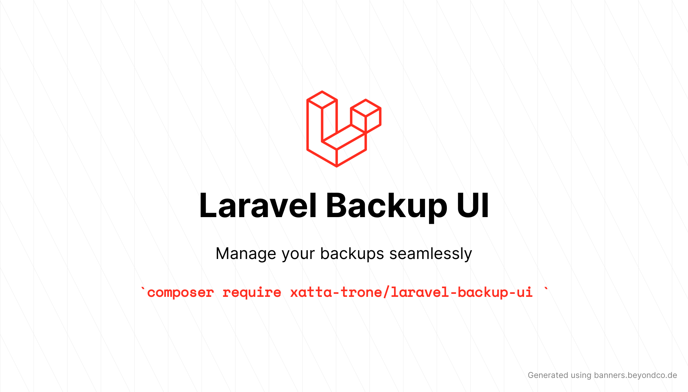

<p align="center"></p>

<p align="center">
<a href="https://packagist.org/packages/xatta-trone/laravel-backup-ui"></a>
<a href="https://packagist.org/packages/xatta-trone/laravel-backup-ui"></a>
<a href="https://packagist.org/packages/xatta-trone/laravel-backup-ui"></a>
<a href="https://packagist.org/packages/xatta-trone/laravel-backup-ui"></a>
</p>

### Features

- 📂 **View all the Laravel backups** in your application,
- 🎚 **Filter** by disk type, timestamp, pagination
- and more...


### Requirements

- **PHP 8.0+**
- **Laravel 8+**

## Installation

Via Composer

```bash
composer require xatta-trone/laravel-backup-ui
```

### Usage

Once the installation is complete, you will be able to access **Log Viewer** directly in your browser.

By default, the application is available at: `{APP_URL}/laravel-backups`.

(for example: `https://my-app.test/laravel-backups`)

## Advanced usage
### Customize view
Publish `views` into `/resources/views/vendor/xatta-trone/` for view customization:

```bash
php artisan vendor:publish \
  --provider="XattaTrone\LaravelBackupUi\LaravelBackupUiServiceProvider" \
  --tag=laravel-backup-ui.views
``` 

### Edit configuration
Publish `laravel-backup-ui.php` configuration file into `/config/` for configuration customization:

```bash
php artisan vendor:publish \
  --provider="XattaTrone\LaravelBackupUi\LaravelBackupUiServiceProvider" \
  --tag=laravel-backup-ui.config
``` 

## Change log

Please see the [changelog](changelog.md) for more information on what has changed recently.

## Testing

```bash
composer test
```

## Contributing

Please see [contributing.md](contributing.md) for details and a todolist.

## Security

If you discover any security related issues, please email monzurul.ce.buet@gmail.com instead of using the issue tracker.

## Credits

- [Monzurul Islam][link-author]
- [All Contributors][link-contributors]

## License

MIT. Please see the [license file](license.md) for more information.

[ico-version]: https://img.shields.io/packagist/v/xatta-trone/laravel-backup-ui.svg?style=flat-square
[ico-downloads]: https://img.shields.io/packagist/dt/xatta-trone/laravel-backup-ui.svg?style=flat-square
[ico-travis]: https://img.shields.io/travis/xatta-trone/laravel-backup-ui/master.svg?style=flat-square
[ico-styleci]: https://styleci.io/repos/12345678/shield

[link-packagist]: https://packagist.org/packages/xatta-trone/laravel-backup-ui
[link-downloads]: https://packagist.org/packages/xatta-trone/laravel-backup-ui
[link-travis]: https://travis-ci.org/xatta-trone/laravel-backup-ui
[link-author]: https://github.com/xatta-trone
[link-contributors]: ../../contributors
